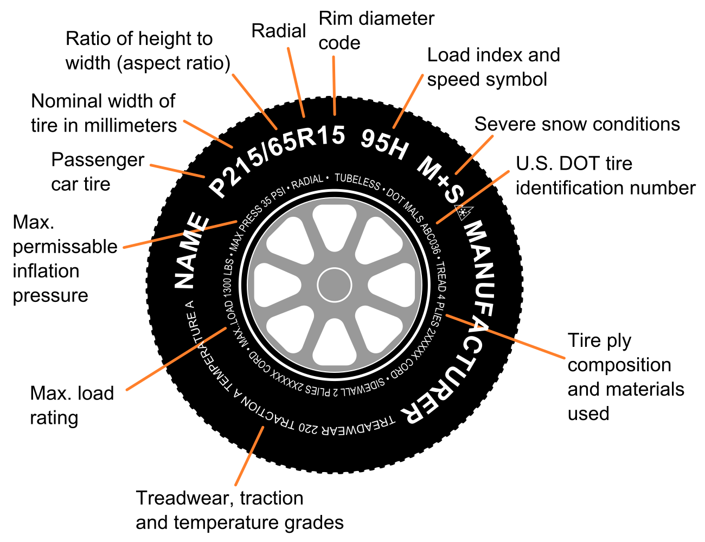

Sidewall
=============

_Sidewall_ is a package for interacting with the [Dimensions](https://app.dimensions.ai) search API.  It provides object classes for Dimensions entities, fetches data incrementally, caches results, copes with rate limits, and more, to make working with Dimensions in Python more natural.  "Sidewall" is a loose acronym for _**Si**mple **D**im**e**nsions **w**r**a**pper c**l**ient **l**ibrary_.

*Authors*:      [Michael Hucka](http://github.com/mhucka)<br>
*Repository*:   [https://github.com/caltechlibrary/sidewall](https://github.com/caltechlibrary/sidewall)<br>
*License*:      BSD/MIT derivative &ndash; see the [LICENSE](LICENSE) file for more information

[](https://choosealicense.com/licenses/bsd-3-clause)
[](http://shields.io)
[](http://shields.io)


Table of Contents
-----------------

* [Introduction](#-introduction)
* [Installation instructions](#-installation-instructions)
* [Using Sidewall](#︎-using-sidewall)
   * [Basic setup and use](#basic-setup-and-use)
   * [Basic principles of running queries](#basic-principles-of-running-queries)
   * [Data mappings](#data-mappings)
      * [`Person`](#person), with subclasses `Authors` and `Researchers`
      * [`Organization`](#organization)
      * [`Publication`](#publication)
      * [`Journal`](#journal)
      * [`Grant`](#grant)
* [Getting help and support](#-getting-help-and-support)
* [Acknowledgments](#︎-acknowledgments)
* [Copyright and license](#︎-copyright-and-license)


☀ Introduction
-----------------------------

[Dimensions](https://app.dimensions.ai) offers a networked API and search language (the [DSL](https://docs.dimensions.ai/dsl/language.html)).  However, interacting with the DSL currently requires sending a search string to the Dimensions server, then interpreting the JSON results and handling various issues such as iterating to obtain more than 1000 values (which requires the use of multiple queries), staying within API rate limits, and more.  _Sidewall_ ("**Si**mple **D**im**e**nsions **w**r**a**pper c**l**ient **l**ibrary") provides a higher-level interface for working more conveniently with the Dimensions DSL and network API.  Features of Sidewall include:

* object classes for different Dimensions data entities
* lazy object values filled in automatically behind the scenes
* results iterator fetches data over the net as needed
* automatic caching of search results for speed and efficiency
* automatic throttling to keep within API rate limits

✺ Installation instructions
---------------------------

The following is probably the simplest and most direct way to install this software on your computer:
```sh
sudo python3 -m pip install git+https://github.com/caltechlibrary/sidewall.git --upgrade
```

Alternatively, you can clone this GitHub repository and then run `setup.py`:
```sh
git clone https://github.com/caltechlibrary/sidewall.git
cd sidewall
sudo python3 -m pip install . --upgrade
```

▶︎ Using Sidewall
----------------

Sidewall is meant to be used from other programs; it does not provide a standalone command-line interface or graphical user interface.  At this time, Sidewall only supports certain kinds of Dimensions queries as discussed below.


### Basic setup and use

To use Sidewall, import the package and the symbol `dimensions` in your Python code:

```python
import sidewall
from sidewall import dimensions
```

In case of problems, it may be useful to turn on debugging in Sidewall to see everything that is happening behind the scenes.  You can do that by using `set_debug()` after importing Sidewall:

```python
sidewall.set_debug(True)
```

To run queries, you will need first to have an [account with Dimensions](https://plus.dimensions.ai/support/solutions/articles/23000013103-how-can-i-get-an-individual-login-for-dimensions-and-what-can-i-do-with-this-).  There are multiple ways of supplying user credentials to Sidewall.  The most secure and more convenient way is to invoke the `login()` method without any arguments:

```python
dimensions.login()
```

When done this way, Sidewall will use the operating system's keyring/keychain functionality to get the user name and password.  If the information does not exist from a previous call to `dimensions.login()`, Sidewall will ask you for the user name and password interactively, and then store it in the keyring/keychain for next time.

If asking the user for credentials interactively on the command line is unsuitable for the application you are writing, you can also supply a user name and password to the `login()` method as keyword arguments:

```python
dimensions.login(username = 'somelogin', password = 'somepassword')
```


### Basic principles of running queries

Sidewall defines a method, `query()`, which you can use to run a search in Dimensions and get back results.  The method takes a single argument, a string.  Here is an example:

```python
results = dimensions.query('search publications for "SBML" return publications')
```

The form of the search query string that Sidewall can use is limited in ways described shortly.  The `query()` method returns a Python iterator object so that you iterate over the results, taken the `len()`, and do other typical operations.

The items returned by the iterator will be Sidewall objects of the kind discussed in the section below on [Data mappings]().  The specific classes of objects returned will correspond to the type of record expressed in the tail end of the query handed to `query()`.  For example, a query that ends in `return publications` will produce Sidewall `Publications` objects; a query that ends in `return researchers` will produce Sidewall `Researcher` objects; and so on.

Sidewall currently puts the following limitations on the form of the query search string:
* it must begin with `search`
* it must end with `return publications`, `return researchers`, or `return grants`
* it must only return a single type of thing (i.e., researchers _or_ publications _or_ grants)
* it must not put facet specifiers or limits on the returned results
* it must not use aggregation or other advanced DSL features

The following is a complete example of using Sidewall to search for publications containing thes string "SBML", and then printing the year and DOI for each such publication found:

```python
import sidewall
from sidewall import dimensions

dimensions.login()
results = dimensions.query('search publications for "SBML" return publications')

print('Total found: {}'.format(len(results)))
for pub in results:
    print('{}: {}'.format(pub.year, pub.doi))
```


### Data mappings

Sidewall defines object classes such as `Researcher`, `Publication`, and a few others to represent the different types of entities returned as the results of a Dimensions search query.  Sidewall's objects attempt to smooth over some of the confusing aspects of the data representations in Dimensions by providing single objects that consolidate different fields and facets of the same underlying "thing".  Further, the fields of an object sometimes are not available from a given query Dimensions performed by the user but _may_ be available if a _different_ kind of query is performed; Sidewall uses this knowledge in some cases to expand object field values automatically and behind the scenes as needed.

The following data classes are defined by Sidewall at this time; note that this is not all the types of data that Dimensions provides today, but future work may improve Sidewall's coverage.

* `Person`, with subclasses `Authors` and `Researchers`
* `Organization`
* `Publication`
* `Journal`
* `Grant`
* several very simple objects: `Category`, `City`, `Country`, `State`


#### `Person`

Dimensions doesn't expose an underlying base class for people; instead, it returns unnamed data structures that basically refer to people in different contexts.  Sidewall currently understands two such contexts: authors of publications (when a query uses `return publications`), and "researchers" (when a query uses `return researchers`).  Sidewall introduces a parent class called `Person` because the objects in these two contexts are so similar, and provides two derived classes: `Author` and `Researcher`.  Both of the derived classes have the same fields.  The distinction provided by the derived classes is necessary because **the list of affiliations for an `Author` is relative to a particular publication and may not be all the affiliations that a person has**.  Thus, affiliations for authors must be understood in the context of a particular search for publications.  The use of two classes indicates the context, so that callers can correctly interpret the list of affiliations.

```
           ┌──────────────┐
           │    Person    │
           └──────────────┘
                  ^
        ┌─────────┴──────────┐
┌───────┴──────┐      ┌──────┴───────┐
│    Author    │      │  Researcher  │
└──────────────┘      └──────────────┘
```

The following table describes the fields and how they relate to values returned from Dimensions:

|   Field                | Type                   | In `return researchers`? | In `return` `publications`?      | In `return grants`? | Filled? |
|------------------------|------------------------|--------------------------|--------------------------------|---------------------|---------|
| `affiliations`         | [`Organization`, ...]  | via `research_orgs`      | ✓                              | ✓                   | ✓       |
| `current_organization` | `Organization`         | n                        | via `current_organization_id`  | n                   | ✓       |
| `first_name`           | str                    | ✓                        | ✓                              | ✓                    | n       |
| `middle_name`          | str                    | n                        | n                              | ✓                   | n       |
| `id`                   | str                    | ✓                        | as `researcher_id`             | ✓                   | n       |
| `last_name`            | str                    | ✓                        | ✓                              | ✓                    | n       |
| `orcid`                | str                    | as `orcid_id`            | ✓                              | `orcid_id`          | ✓       |
| `role`                 | str                    | n                        | n                              | ✓                   | n       |

The `affiliations` field in Sidewall's `Person` (and consequently `Author` and `Researcher`) is a list of `Organization` class objects (see below).  Although affiliations as returned by Dimensions are sparse when using a query that ends with `return researchers` (they consist only of organization identifiers), Sidewall hides this by providing complete `Organization` objects for the `affiliations` field of a `Person`, and using behind-the-scenes queries to Dimensions to fill out the organization info when the object field values are accessed.  Thus, calling programs do not need to do anything to get organization details in a result regardless of whether they use `return publications` or `return researchers`&mdash;Sidewall always provides `Organization` class objects and handles getting the field values automatically.

To make data access more uniform, Sidewall also replaces the field `current_organization_id` (which in Dimensions is a string, the identifier of an organization) with the field `current_organization`.  Its value is an `Organization` object corresponding to the organization whose identifier is found in `current_organization_id`.

`Author` class objects are returned when returning publication results, and in those cases, the list of a person's affiliations will reflect their affiliations with respect to a particular publication.  However, sometimes it's convenient to get more information about an author, such as the complete list of affiliations that Dimensions has for the person in question.  Sidewall allows you to create a `Researcher` object out of an `Author` object for that reason.  Here is an example to illustrate the differences between authors and researchers and how you can convert the former to the latter:

```python
>>> import sidewall
>>> from sidewall import dimensions, Researcher
>>> dimensions.login()
>>> results = dimensions.query('search publications in title_only for "SBML" where year=2003 return publications')
>>> pub1 = next(results)
>>> author1 = pub1.authors[0]
>>> author1
<Author ur.0665132124.52: 'M. Hucka'>
>>> author1.affiliations
[]
>>> researcher1 = Researcher(author1)
>>> researcher1.affiliations
[<Organization grid.214458.e: 'University of Michigan'>, <Organization grid.20861.3d: 'California Institute of Technology'>, <Organization grid.10392.39: 'University of Tübingen'>]
>>> 
```

Finally, note that the field `role` is present for `Researcher` objects listed only in the context of `Grant` results.  Its value is not filled in other contexts.


#### `Organization`

Sidewall uses the object class `Organization` to represent an organization in results returned by Dimensions.  In Sidewall, the set of fields possessed by an `Organization` is the union of all fields that Dimensions provides in different contexts for organizations.  The following table describes the fields and how they relate to values returned from Dimensions:

|   Field         | Type | In "return research_orgs"? | In "return publications"? | Sidewall filled? |
|-----------------|------|----------------------------|---------------------------|--------------------|
| `acronym`       | str  | ✓                          | n                         | ✓                  |
| `city`          | str  | n                          | ✓                         | n                  |
| `city_id`       | str  | n                          | ✓                         | n                  |
| `country`       | str  | n                          | ✓                         | n                  |
| `country_code`  | str  | n                          | ✓                         | n                  |
| `country_name`  | str  | ✓                          | n                         | ✓                  |
| `id`            | str  | ✓                          | ✓                         | n                  |
| `name`          | str  | ✓                          | ✓                         | n                  |
| `state`         | str  | n                          | ✓                         | n                  |
| `state_code`    | str  | n                          | ✓                         | n                  |

Dimensions returns different field values in different contexts.  For example, the information about organizations included in an author's affiliation list in a publication is somewhat different from what is provided if a search ending in `return research_orgs` is used.  Sidewall makes the assumption that an organization with a given organization identifier ("grid id") is the same organization no matter the context in which it is mentioned in a search result, and so Sidewall smooths over the field differences and, as with `Researcher` and `Author`, queries Dimensions behind the scenes to get missing values when it can (and when they exist).


#### `Publication`

The `Publication` object class is mostly unchanged from the Dimensions publication entity, but in Dimensions, different fields are exposed depending on the type of publication and whether fieldset modifiers are being used.  (The available fieldsets for publications are `basics`, `extras`, and `book`.)  Sidewall's `Publication` object class contains all possible fields, but the values of some fields may not be filled in depending on the type of publication in question.  For example, journals will not have a value for `book_doi`.  The following table describes the fields in `Publication` objects:


| Field                        | Type            | In `return publications`? |
|------------------------------|-----------------|---------------------------|
| `altmetric`                  | str             | ✓
| `authors`                    | [`Author`, ...] | via `author_affiliations` |
| `author_affiliations`        | [`Author`, ...] | via `author_affiliations` |
| `book_doi`                   | str             | ✓
| `book_series_title`          | str             | ✓
| `book_title`                 | str             | ✓
| `date`                       | str             | ✓
| `date_inserted`              | str             | ✓
| `doi`                        | str             | ✓
| `field_citation_ratio`       | str             | ✓
| `id`                         | str             | ✓
| `issn`                       | str             | ✓
| `issue`                      | str             | ✓
| `journal`                    | `Journal`       | ✓
| `linkout`                    | str             | ✓
| `mesh_terms`                 | str             | ✓
| `open_access`                | str             | ✓
| `pages`                      | str             | ✓
| `pmcid`                      | str             | ✓
| `pmid`                       | str             | ✓
| `proceedings_title`          | str             | ✓
| `publisher`                  | str             | ✓
| `references`                 | str             | ✓
| `relative_citation_ratio`    | str             | ✓
| `research_org_country_names` | str             | ✓
| `research_org_state_names`   | str             | ✓
| `supporting_grant_ids`       | str             | ✓
| `times_cited`                | str             | ✓
| `title`                      | str             | ✓
| `type`                       | str             | ✓
| `volume`                     | str             | ✓
| `year`                       | str             | ✓

Sidewall's `Publication` objects use a list of `Author` objects to represent authors, and introduce an alias called `authors` for the field `author_affiliations`.  The latter alias is for convenience and an attempt to bring more intuitiveness to the structure of publications records.  (The name `author_affiliations` in the Dimensions data is potentially confusing because the name suggests it may be a list of organizations rather than a list of authors.  Providing a field named `authors` removes this ambiguity.)


#### `Journal`

The `Journal` object class is simple.  It is a direct mapping to the JSON data object that Dimensions returns as the value of a publication's `journal` field.

| Field | Type | In `return publications`? |
|-------|------|---------------------------|
| id    | str  | ✓                         |
| title | str  | ✓                         |


#### `Grant`

...Forthcoming...


⁇ Getting help and support
--------------------------

If you find an issue, please submit it in [the GitHub issue tracker](https://github.com/caltechlibrary/sidewall/issues) for this repository.


☺︎ Acknowledgments
-----------------------

The [vector artwork](https://commons.wikimedia.org/wiki/File:Tire_code_-_en.svg) of a car tire used as a logo for this repository was created by [Flanker](https://commons.wikimedia.org/wiki/User:F_l_a_n_k_e_r).  It is licensed under the Creative Commons [Attribution 3.0 Unported](https://creativecommons.org/licenses/by/3.0/deed.en) license.

Sidewall makes use of numerous open-source packages, without which it would have been effectively impossible to develop Sidewall with the resources we had.  We want to acknowledge this debt.  In alphabetical order, the packages are:

* [keyring](https://github.com/jaraco/keyring) &ndash; access the system keyring service from Python
* [requests](http://docs.python-requests.org) &ndash; an HTTP library for Python
* [setuptools](https://github.com/pypa/setuptools) &ndash; library for `setup.py`
* [urllib3](https://urllib3.readthedocs.io/en/latest/) &ndash; HTTP client library for Python
* [validators](https://github.com/kvesteri/validators) &ndash; data validation package for Python


☮︎ Copyright and license
---------------------

Copyright (C) 2019, Caltech.  This software is freely distributed under a BSD/MIT type license.  Please see the [LICENSE](LICENSE) file for more information.
    
<div align="center">
  <a href="https://www.caltech.edu">
    
  </a>
</div>
